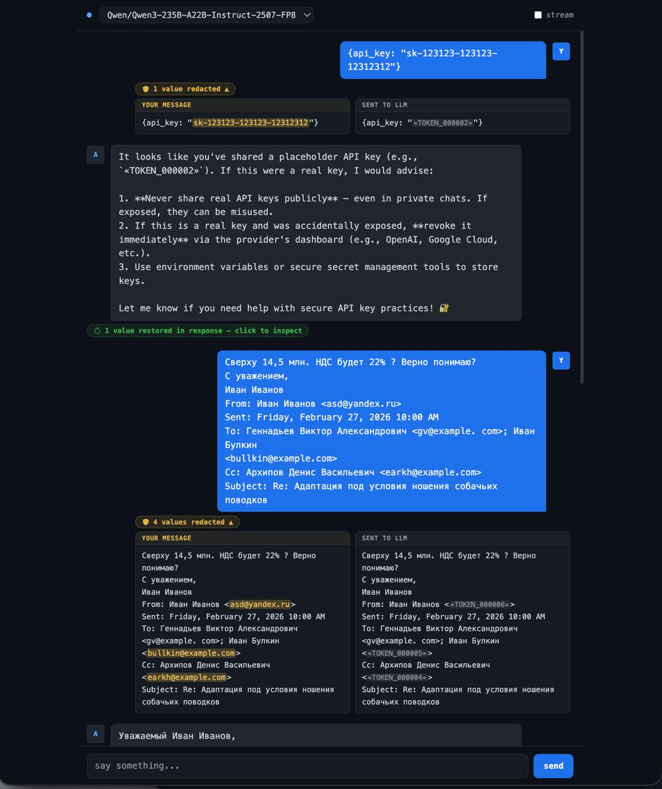

# Privacy sanitization

The proxy intercepts every outgoing message, strips sensitive values, and restores them in the response. The upstream LLM operates entirely on placeholder tokens and never sees your real data.

## How it works

```
Your app          Proxy                       Gonka LLM
   │                │                              │
   │─ "My key is sk-abc123" ──────────────────────►│
   │                │  1. classify text             │
   │                │  2. replace: sk-abc123        │
   │                │     → «TOKEN_000001»          │
   │                │─ "My key is «TOKEN_000001»" ─►│
   │                │◄─ "The key «TOKEN_000001» ..." │
   │                │  3. restore tokens            │
   │◄─ "The key sk-abc123 ..."────────────────────  │
```

1. The proxy receives your chat request.
2. Each message is scanned by one or more classifiers (see below).
3. Detected sensitive values are replaced with stable placeholders (`«TOKEN_000001»`, `«TOKEN_000002»`, ...).
4. The modified request is forwarded to the upstream node.
5. The upstream response is scanned for placeholders and the originals are substituted back in before the response reaches your app.

The same token is reused if the same value appears multiple times in a conversation, so the LLM can reason consistently about it without ever knowing what it is.

## Classifiers

Classifiers run concurrently. Results are merged and deduplicated before redaction is applied. If a classifier is slow or unavailable, it is skipped after its deadline and the remaining classifiers still apply.

### NER sidecar

A Python microservice that runs two NER models:

- **Natasha** - Russian-language model, catches Cyrillic person names, organisations, and locations.
- **spaCy `en_core_web_sm`** - English-language model, catches Latin person names, organisations, locations, monetary amounts, and dates.

The sidecar exposes a single `/classify` endpoint. The Go client sends the text and receives a list of `{start, end, label}` spans. It runs as a separate Docker container in the `sanitize` Compose profile.

Typical latency: **under 100ms** per request on CPU.

### LLM classifier

A local LLM running inside Ollama. It is used for things that NER cannot reliably detect: API keys, passwords, tokens, private keys, and credentials of any format.

**Default model:** `qwen3:4b-instruct-2507-q4_K_M` (~2.6 GB, quantized to 4-bit)

The model is prompted with a strict system message and a few-shot examples:

```
Extract sensitive data from the text. Return a JSON array of exact strings
that are sensitive. Return [] if nothing sensitive found.

Sensitive data includes:
- API keys and tokens (sk-, pk-, ghp_, Bearer, ...)
- Passwords and secrets mentioned explicitly
- Email addresses
- Phone numbers
- Full person names (English and Russian)
- Credit card numbers, IBANs, bank account numbers
- Private keys (long hex or base64 strings)

Do NOT flag: «TOKEN_» placeholders, city names, common words, dates, regular numbers.

Return ONLY a valid JSON array of the exact sensitive strings. No explanation.
```

The model is asked to return the sensitive strings verbatim. The proxy then locates each string in the original text using Go's `strings.Index` and records the byte spans. This is more reliable than asking the model for offsets directly, because small models frequently miscalculate positions.

Chain-of-thought thinking is suppressed via the `/no_think` control token (Qwen3-specific) and the `think: false` API parameter. If the model still emits a `<think>...</think>` block, it is stripped before parsing.

Typical latency: **5-20 seconds** on CPU, depending on message length and hardware.

### Budget and partial results

All classifiers run in parallel under a shared timeout (`classifierBudget = 120s`). If any classifier exceeds the budget, its results are discarded and the remaining detected spans still apply. This ensures the proxy never blocks indefinitely.

## Span validation

After classifiers return their spans, each one is validated before being applied:

- Offsets must be within the text bounds and fall on UTF-8 character boundaries.
- The span must not already contain a `«TOKEN_»` placeholder (no double-redaction).
- The character immediately before and after the span must be a word delimiter (space, punctuation, newline, etc.). This prevents partial matches -- for example, if the LLM returns `sd@example.com` but the actual text contains `asd@example.com`, the match is rejected.

Overlapping spans are deduplicated (the wider span wins).

## History messages

The last user message in a conversation receives the full classifier pipeline (NER + LLM). Older history messages are only processed by the NER sidecar to avoid paying LLM latency for text that was already sanitized in a previous turn.

## Web UI

The built-in chat UI at `http://localhost:8080` shows what happened to each message:

- A yellow shield badge next to your message shows how many values were redacted.
- Click it to open a side-by-side panel: your original text on the left, the redacted version that was sent to the LLM on the right. Sensitive values are highlighted in the original; placeholders are shown in the sent version.
- A green badge below the assistant response shows which placeholders were restored and what they were replaced with.



The screenshot shows two examples: an API key (`sk-123123-...`) being replaced with `«TOKEN_000002»`, and a Russian email thread with 4 values redacted (email addresses replaced with tokens while the message text passes through unchanged).

## Choosing a model

| Model | Size | Speed (CPU) | Quality |
|---|---|---|---|
| `qwen3:0.6b` | ~400 MB | ~1-3s | Low - misses some patterns |
| `qwen3:1.7b` | ~1 GB | ~3-8s | Medium |
| `qwen3:4b-instruct-2507-q4_K_M` | ~2.6 GB | ~5-20s | Good (recommended) |

To switch models, update `SANITIZE_LLM_MODEL` in `.env` and pull the new model:

```bash
docker compose --profile sanitize run --rm ollama pull <model-name>
docker compose --profile sanitize up -d --build
```

## Skipping the LLM for speed

If latency matters more than coverage, disable the LLM layer and rely only on NER:

```env
SANITIZE=true
SANITIZE_NER=true
SANITIZE_LLM=false
```

NER still catches names, organisations, locations, and dates with sub-100ms latency.

## Source layout

```
internal/sanitize/
  sanitize.go               - TokenMap, Sanitizer, RedactMessages, RestoreBytes
  classifier.go             - Classifier interface and Span type
  stream.go                 - RestoringReader for streaming SSE responses
  ner/ner.go                - NER sidecar HTTP client
  llmclassifier/
    llmclassifier.go        - LLM classifier (Ollama, prompt, parsing)
sanitize-ner/
  app.py                    - FastAPI sidecar exposing /classify
  requirements.txt
```
